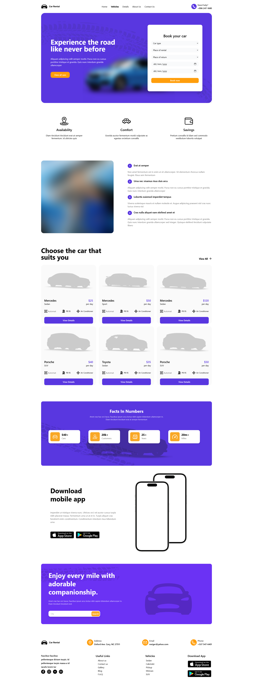
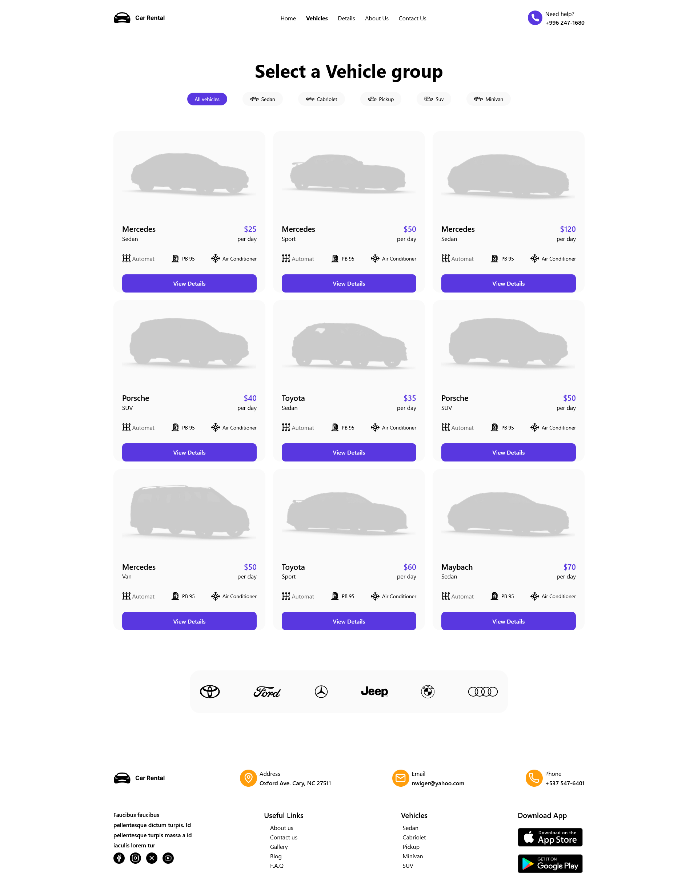
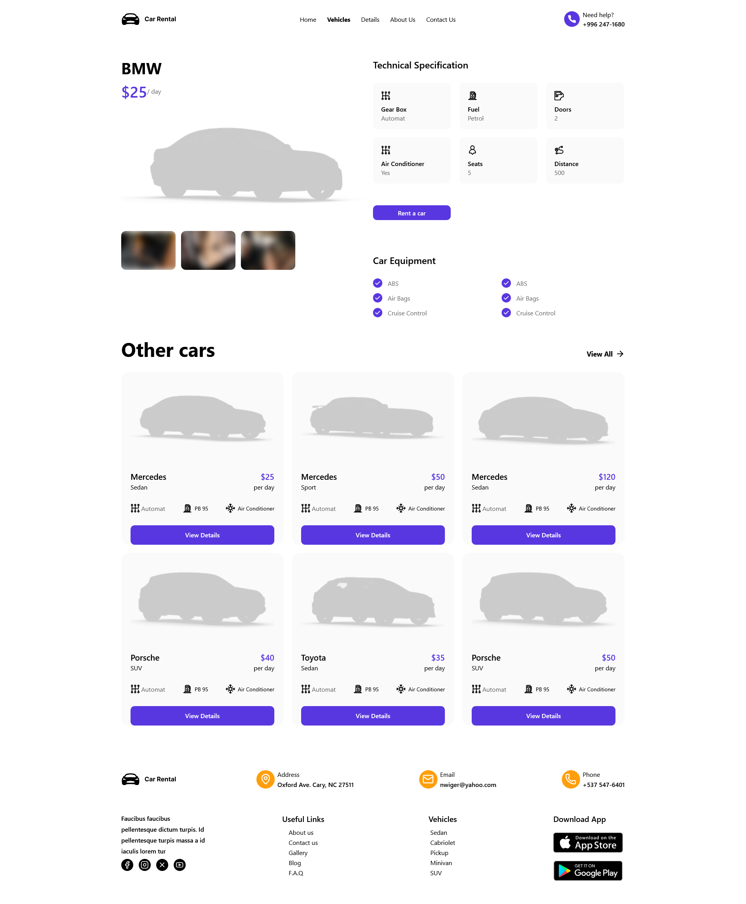

# 🎨 GDG DJSCE – Tech Task 2 (Figma Design Replication using Next.js)

This project is a **pixel-perfect replication** of the given Figma design created as part of the **Google Developer Students Club (GDSC) DJSCE Tech Task**.  
The main objective of this task was to **recreate the provided Figma design exactly as shown**, focusing on maintaining perfect alignment, spacing, and styling — without making it responsive.

---

## 📘 Project Description

This project demonstrates the conversion of a Figma UI design into an actual web interface using **Next.js** and **Tailwind CSS**. Every element, color, font, and layout detail has been replicated to match the Figma design precisely.

The result is a static, non-responsive layout that matches the provided reference design **pixel by pixel**.

You can view the original design here:  
🔗 **[Figma Design Link](https://www.figma.com/design/j3WIhkqYIplVcwYf04q1mU/Tech_Task-2?node-id=1-10448&t=dpShrcrZuXpIGB9C-0)**

---

## 🖼️ Project Preview

Below are some previews of the implemented UI (replace these placeholders with your actual screenshots once available):

### 💻 Home Page Preview



### 📄 Vehicles Page Preview



### 📄 Details Page Preview



---

## 🧰 Technologies Used

This project was developed using the following technologies and tools:

- **Next.js** – React-based framework for building modern web applications
- **Tailwind CSS** – Utility-first CSS framework for rapid and consistent UI styling
- **Lucide React Icons** – For clean and scalable vector icons
- **TypeScript** – For type-safe and maintainable code
- **Next/Image** – For optimized and responsive image rendering

These tools together ensure a clean, modular, and efficient development process, perfectly suited for design replication tasks.

---

## ⚙️ How to Run the Project

To view this project locally, follow these simple steps:

1. **Clone the repository**  
   Open your terminal and run:

   ```bash
   git clone https://github.com/<your-username>/<your-repo-name>.git

   ```

2. **Go to the root Directory**

   Open your terminal and run :

   ```bash
   cd Task-1-Figma-Blueprint

   ```

3. **Install the dependencies**

   Open your terminal and run ;

   ```bash
   npm install

   ```

4. **Run the Project**

   Open your terminal and run ;

   ```bash
   npm run dev
   ```

# Live Link

🔗 **[Live Link](https://tech-tasks-gdgdjsce-nikhil.vercel.app)**
